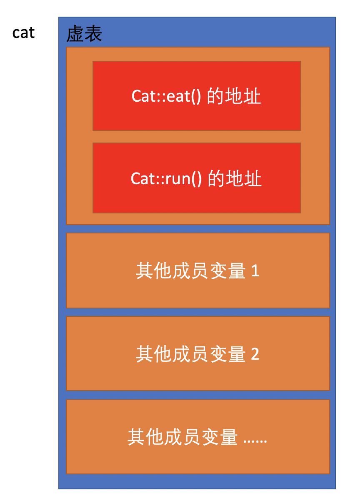
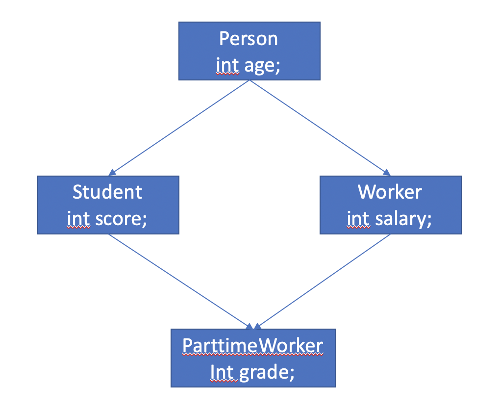
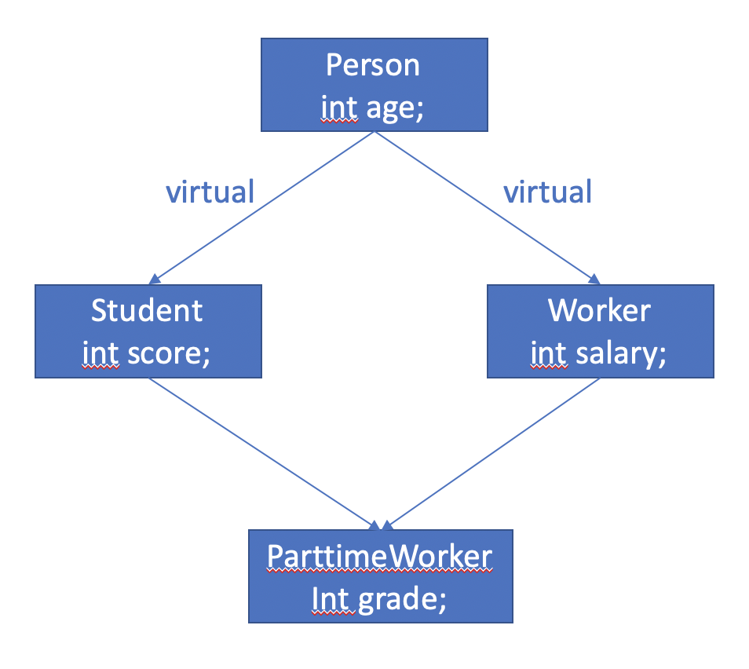

**C++**


[TOC]


> 注意：
>
> 本文所有结论和示例均通过了Xcode测试，使用其他的操作系统或者IDE结果可能会有略微差异。


# 前提

[ASCII码表](https://baike.baidu.com/item/ASCII/309296?fromtitle=ascii码&fromid=99077&fr=aladdin)

本文中部分示例代码看[这里](../Demo/C++/)

[利用汇编窥探编程语言的本质](利用汇编窥探编程语言的本质.md)

[C语言](C语言.md)


# 编程规范

其实所谓的编程规范无非就是人为规定的一种编程范式而已，就是为了统一编码的风格，所以我认为以下4种皆可，根据具体情况选择：

1. 团队内部大家公认的编程规范
2. 官方风格
3. 个人喜好

本文的所有标识符命名皆遵守[驼峰命名法](https://baike.baidu.com/item/骆驼命名法/7794053?fr=aladdin)，代码格式(缩进，换行，空格等)按照本人习惯统一风格

编码的时候遵守一种统一的编程规范的好处有以下几点：

- 可读性强
- 有强迫症的人内心不会抓狂
- 专业


# cin cout 函数

```c++
#include <iostream>
using namespace std;
int main(int argc, const char * argv[]) {
    int a;
    // cin使用右移动运算符>>，将输入的数值赋值给a
    cin >> a;
    // cout使用左移运算符<<，输出a的值
    cout << "a = " << a << endl; // endl 表示换行
    
    return 0;
}
```


# 函数重载(function overload)

## 函数重载的规则

函数名相同，参数个数不一样，类型不一样，或者顺序不一样

> 注意：
>
> 返回值类型的不同与函数重载无关
>
> 调用函数时，实参的隐式类型转换，默认参数的设置 等情况都有可能会产生二义性

- 参数个数不一样

  ```c++
  int sum1(int v1, int v2) {
      return v1 + v2;
  }
  int sum1(int v1, int v2, int v3) {
      return v1 + v2 + v3;
  }
  ```

- 参数类型不一样

  ```c++
  int sum2(int v1, int v2) {
      return v1 + v2;
  }
  double sum2(double v1, double v2) {
      return v1 + v2;
  }
  ```

- 参数顺序不一样

  ```c++
  int sum3(int v1, double v2) {
      return v1 + int(v2);
  }
  int sum3(double v1, int v2) {
      return int(v1) + v2;
  }
  
  ```

- 只有返回值类型不同(*不构成重载*)

  ```c++
  int sum4(int v1, int v2) {
      return v1 + v2;
  }
  
  // 编译报错: Functions that differ only in their return type cannot be overloaded
  //double sum4(int v1, int v2) {
  //    return v1 + v2;
  //}
  ```

- 实参的隐式类型转换(*调用函数的时候可能会产生二义性*)

  ```c++
  void printValue(long v1) {
      cout << "test(long v1)" << endl;
  }
  
  void printValue(double v1) {
      cout << "test(double v1)" << endl;
  }
  
  void test1() {
      // 编译报错: Call to 'printValue' is ambiguous
      // 原因：10可以被隐式转换成long或者double，编译器懵了，不知道你到底想转哪一个
      // 正确的调用：printValue(10l) or printValue(10.0)
  //    printValue(10);
      
      printValue(10l);
      printValue(10.0);
  }
  ```


- 默认参数情况(*调用函数的时候可能会产生二义性*)

  ```c++
  int sum5(int v1, int v2 = 10) {
      return v1 + v2;
  }
  int sum5(int v1) {
      return v1 + 10;
  }
  
  void test2() {
      // 编译报错: Call to 'sum5' is ambiguous
  //    sum5(20);
  }
  ```

## 函数重载的本质

其实是C++中采用了name mangling or name decoration技术，即C++编译器会对重载的函数名按照一定的规则进行改编，底层原理还是函数名不同的函数

示例代码如下：

```c++
int sum(int v1, int v2) {
    return v1 + v2;
}

int sum(int v1, int v2, int v3) {
    return v1 + v2 + v3;
}

void test() {
    sum(1, 2);
    sum(3, 4, 5);
}
```

对应的汇编代码如下（从汇编代码可以看出来上边的2个sum函数调用分别对应2个不同地址的sum函数，所以我们可以认为，虽然函数的名称看起来相同，但是本质上还是2个独立的函数）：

`0x100001230` & `0x100001250` 分别对应上边调用的2个sum函数的地址

```assembly
FunctionOverload`test:
    0x100001270 <+0>:  pushq  %rbp
    0x100001271 <+1>:  movq   %rsp, %rbp
    0x100001274 <+4>:  subq   $0x10, %rsp
    0x100001278 <+8>:  movl   $0x1, %edi
    0x10000127d <+13>: movl   $0x2, %esi
    0x100001282 <+18>: callq  0x100001230               ; sum at main.cpp:98
    0x100001287 <+23>: movl   $0x3, %edi
    0x10000128c <+28>: movl   $0x4, %esi
    0x100001291 <+33>: movl   $0x5, %edx
    0x100001296 <+38>: movl   %eax, -0x4(%rbp)
    0x100001299 <+41>: callq  0x100001250               ; sum at main.cpp:102
    0x10000129e <+46>: movl   %eax, -0x8(%rbp)
    0x1000012a1 <+49>: addq   $0x10, %rsp
    0x1000012a5 <+53>: popq   %rbp
->  0x1000012a6 <+54>: retq  
```


# 函数默认参数

## 函数默认参数的规则

默认参数可以是 常量，全局符号（变量，函数名）且默认参数必须从最右边开始

> 注意：
>
> - 默认参数只能放在函数声明中（如果声明和定义同时存在）
>
> - 默认参数与函数重载可能会产生冲突，二义性

示例如下：

```c++
int age = 10;

void test1() {
    cout << "test()" << endl;
}
void test2() {
    cout << "test2()" << endl;
}

void printParameters(int v1, int v2 = 10, int v3 = age, void (*p)() = test1) {
    cout << "v1 is: " << v1 << endl;
    cout << "v2 is: " << v2 << endl;
    cout << "v3 is: " << v3 << endl;
    p();
}

void test3() {
    printParameters(10);
    printParameters(10, 20, 30);
    printParameters(10, 30, 40, test2);
}
```

## 函数默认参数的本质

当使用默认参数的时候，并且当默认参数不为0的时候，编译器会为我们将默认参数值当成普通的参数进行传递

```c++
int sum(int v1, int v2 = 2) {
    return v1 + v2;
}

void test4() {
    sum(1);
    
    /*
     对应的汇编代码：
     DefaultParameters`test4:
         0x100001290 <+0>:  pushq  %rbp
         0x100001291 <+1>:  movq   %rsp, %rbp
         0x100001294 <+4>:  subq   $0x10, %rsp
         0x100001298 <+8>:  movl   $0x1, %edi
         0x10000129d <+13>: movl   $0x2, %esi
         0x1000012a2 <+18>: callq  0x100001270               ; sum at main.cpp:47
         0x1000012a7 <+23>: movl   %eax, -0x4(%rbp)
     ->  0x1000012aa <+26>: addq   $0x10, %rsp
         0x1000012ae <+30>: popq   %rbp
         0x1000012af <+31>: retq
     
     汇编代码：movl $0x2, %esi 这一句表示编译器最终也会将默认参数当作一般的参数存储到寄存器中进行运算
     也就是说：默认参数和一般的参数在本质上没有区别
     */
}
```


# extern "C"

虽然说C++是C语言的超集，并且基本上在C++可以直接调用C语言的函数，但是C++与C语言还是在用不同的编译系统，语法上还是有很多不同的特性，如果你希望编写的纯C的代码在C++上被调用，可以使用 `extern "C"` 去修饰C语言的代码块

`extern "C"` 修饰的代码会按照C语言的方式去编译

> 注意：
>
> 如果函数既有声明又有定义，函数的声明必须被 `extern "C"` 修饰，定义可以不必

示例如下：

```c++
// 可以有以下4种不同的用法

// 用法一：
extern "C" void test1() {
    cout << "test1()" << endl;
}
// 用法二：
extern "C" {
    void test2() {
        cout << "test2()" << endl;
    }
}
// 用法三：
extern "C" {
    // 这个会引用系统库math.h
    #include <math.h>
}
// 用法四(更通常的做法，在math.h内部已经做了extern "C"的处理)：
#include "math.h"

int main(int argc, const char * argv[]) {
    
    test1();
    test2();
    
    int result = sum(1, 2);
    cout << result << endl;
  
    return 0;
}
```

*math.h*

```c
#ifndef math_h
#define math_h

#include <stdio.h>

#ifdef __cplusplus
extern "C" {
#endif // __cplusplus

int sum(int v1, int v2);

#ifdef __cplusplus
}
#endif // __cplusplus

#endif /* math_h */
```

*math.c*

```c
#include "math.h"

int sum(int v1, int v2) {
    return v1 + v2;
}
```


# #pragma once

防止**整个文件**的内容被重复包含。

这个一般貌似很少用，而且它的作用域是**整个文件**。

更通常的做法如下：

某一个 .h 文件

```c
#ifndef math_h
#define math_h

// Code here.

#endif /* math_h */
```


# 内联函数

内联函数属于编译器特性，使用 `inline` 关键字修饰的函数，就是内联函数。

示例如下：

```c++
inline int test() {
  cout << "test()" << endl;
}
```

简单理解就是：内联函数，编译器会将代码进行必要的**优化**，比如减少函数的调用，像上边的示例代码，编译器就会将test函数调用省掉，直接使用函数题进行编译。

不过现在的开发工具，一般情况在release模式下，默认都会做最大的优化。


# 引用

## 引用的定义

引用的本质是指针，只不过是编译器为开发者提供的语法糖而已，并且相较指针来说，屏蔽了一些功能，这也使得引用用起来更加安全。

可以这样说：**引用就是阉割版的指针**

引用的特点是**比较专一**(*只能在初始化的时候被赋值*)。

> 注意：
>
> 如果使用引用能够实现的操作，就不要使用指针。

指针和引用的示例如下：

```c++
// 用指针实现值交换函数
void swapValue(int *v1, int *v2) {
    int tmp = *v1;
    *v1 = *v2;
    *v2 = tmp;
}

// 用引用实现值交换函数
void swapValue(int &v1, int &v2) {
    int tmp = v1;
    v1 = v2;
    v2 = tmp;
}

int main(int argc, const char * argv[]) {
    int a = 10;
    int *p = &a;
    *p = 20;
    cout << "a = " << a << endl;
    
    int b = 20;
    int &ref = b;
    ref = 30;
    cout << "b = " << b << endl;
    
    int c = 50;
    int d = 80;
    swapValue(&c, &d);
    cout << "c = " << c << endl;
    cout << "d = " << d << endl;
    
    int e = 100;
    int f = 200;
    swapValue(e, f);
    cout << "e = " << e << endl;
    cout << "f = " << f << endl;
  	
  	// 数组的引用
    int array[] = {1, 2 , 3};
  	// ref1和ref2是两种不同引用的写法
    int (&ref1)[3] = array;
  	// 因为array常量，所以ref2是一个常引用
  	int * const &ref2 = array;
  	ref1[0] = 10;
  	ref2[0] = 100;
    cout << array[0] << "," << array[1] << "," << array[2] << endl;
    
    return 0;
}
```

## 常引用

使用 `const int` 修饰的引用，表明不能通过引用对该引用所指向的变量进行赋值。

```c++
int a = 10;
const int &ref = a;
// 编译报错: Cannot assign to variable 'ref' with const-qualified type 'const int &'
ref = 20;
```

> 注意：
>
> `const int` 和 `int const` 在这里作用一样。

常引用的各种情况示例如下：

```c++
// 使用变量进行初始化
int a = 10;
const int &ref1 = a;

// 使用临时数据(立即数)进行初始化
const int &ref2 = 30;

// 使用表达式进行初始化
const int &ref3 = 1 + 4;

// 使用函数返回值进行初始化
int test() {
    return 10;
}
const int &ref4 = test();

// 使用不同数据类型的值进行初始化
// 注意：
// 这种情况下，会产生临时变量，即引用所指向的值已经不再是被引用的变量了。
// 即，下边代码的运行结果，ref6所指向的值不会随着变量a的修改而修改：
const double &ref5 = 10;
const double &ref6 = a;
a = 20;
// 这段代码运行之后：
// ref6 == 10
// a == 20

// 作为函数参数时，可以接收const和非const的实参
int sum(const int &v1, const int &v2) {
    return v1 + v2;
}
// 使用常引用实参调用函数
sum(ref1, ref2);
int c = 2;
int d = 3;
// 使用非常引用调用函数
sum(c, d);
```


# 类

## 类的概念

C++作为一门面向对象的编程语言，也同样有以下类似的概念：

类，对象，成员变量、成员函数，封装、继承、多态 等等。

C++中类有两种：

- class
- struct

示例如下：

```c++
class PersonC {
    // 成员变量
    int age;
    
    // 成员函数（方法）
    void run() {
        cout << "Person::run()" << endl;
    }
};

struct PersonS {
    // 成员变量
    int age;
    
    // 成员函数（方法）
    void run() {
        cout << "Person::run()" << endl;
    }
};
```

## 对象的创建

```c++
PersonS personS;
PersonS.age = 10;
PersonS.run();

// 对象指针类型
PersonS *personS2 = &personS;
personS2 -> age = 20;
personS2 -> run();
```

## class和struct的区别

只有一个区别：class的成员权限默认是private，而struct的成员权限默认是public.

> 注意：
>
> 在开发中，创建一个类建议使用 `class`, 因为默认成员是 `private`, 这样更安全

所以以下的代码默认会报错：

```c++
PersonC personC;
// Compile error: 'age' is a private member of 'Person_C'
personC.age = 10;
```

将class的成员访问权限设置为public，则可以成功访问：

```c++
class PersonC {
public:
    // 成员变量
    int age;
    
    // 成员函数（方法）
    void run() {
        cout << "Person::run()" << endl;
    }
};

PersonC personC;
personC.age = 10;
personC.run();
```

## this

this是指向当前对象的**指针**，在类内部，可以使用this调用成员(默认可以不写)，示例如下：

```c++
struct Person {
  	// 成员变量
    int age;
    
  	// 成员函数（方法）
    void run() {
        cout << "Person::run(), and age is: " << this -> age << endl;
    }
};

Person xiaoMing;
xiaoMing.age = 12;
xiaoMing.run();
// Output: Person::run(), and age is: 12
```

## 封装

面向对象编程语言的特点，即我们可以选择性地将一些成员暴露给外界去使用，示例如下：

```c++
struct Person {
private:
    int age;
    
public:
    void setAge(int age) {
        if (age <= 0) {
            this -> age = 1;
        } else {
            this -> age = age;
        }
    }
    
    int getAge() {
        return this -> age;
    }
    
    void run() {
        cout << "Person::run(), and age is: " << age << endl;
    }
};

Person xiaoMing;

xiaoMing.setAge(-12);

// Compile error: 'age' is a private member of 'Person'
// xiaoMing.age;

xiaoMing.run();
// Output: Person::run(), and age is: 1

cout << "xiaoMing's age is: " << xiaoMing.getAge() << endl;
// Output: xiaoMing's age is: 1
```

## 内存分配

每一个应用在内存中都有一块属于自己的内存空间，结构如下：

| xxx应用的内存布局 |                             职责                             |
| :---------------: | :----------------------------------------------------------: |
|      栈空间       | 每调用一个函数就会分配一段连续的栈空间，函数调用完成，会自动回收，即自动分配，自动回收 |
|      堆空间       |                      需要手动申请和释放                      |
|      代码区       |                         用于存放代码                         |
|      全局区       |                      用于存放全局变量等                      |

## 堆空间

通过 `malloc` / `new` 申请的内存空间是堆空间，需要程序员负责在合适的时间释放，且必须是一对一的关系，否则就会出现内存泄漏的情况，对应关系如下：

`malloc` -> `free`

`new` -> `delete`

`new []` -> `delete []`

示例如下：

```c++
int *p1 = (int *)malloc(sizeof(int));
int *p2 = (int *)malloc(sizeof(int));
memset(p2, 0, sizeof(int)); // 将p2对应的连续的4个字节内存空间中的每一个字节都设置为0
// ...
delete p1;
delete p2;
```

```c++
int *p1 = new int; // 未初始化
int *p2 = new int(); // 被初始化为0
int *p3 = new int(5); // 被初始化为5
int *p4 = new int[3]; // 未被初始化
int *p5 = new int[3](); // 数组元素全部被初始化为0
int *p6 = new int[3]{}; // 数组元素全部被初始化为0
int *p7 = new int[3]{ 5 }; // 数组首元素被初始化为5，其余元素都被初始化为0
// ...
delete p1;
delete p2;
delete p3;
delete[] p4;
delete[] p5;
delete[] p6;
delete[] p7;
```

`memset` 一般情况都是用来清空内存数据的(即 将对应的**每个字节**都设置为0)。

## 对象的内存

对象的内存会有以下3种情况：*栈空间，堆空间 和 全局区*，示例如下：

```c++
class Person {
    int age;
};

// 全局区(全局存在)
Person person1;

int main(int argc, const char * argv[]) {
    
    // 栈空间(局部变量)
    Person person2;
    
    // 堆空间(手动动态申请内存)
    Person *person3 = new Person;
    delete person3;
    
    return 0;
}
```

## 构造函数 和 析构函数

构造函数用来做对象的初始化，析构函数在对象销毁的时候会被调用。

```c++
struct Car {
    int price;

    Car() {
        price = 100;
        cout << "Car::Car()" << endl;
    }

    ~Car() {
        cout << "Car::~Car" << endl;
    }
};

struct Person {
    int age;
    Car *car;

    // 构造函数(可以接收参数，可以被重载)
  	// 一旦定义了构造函数，必须用其中一个来初始化对象
    Person() {
        cout << "Person::Person()" << endl;
        age = 1;
        car = new Car();
    }

    // 析构函数(就这一个)
  	// 一般在析构函数里边做成员的内存清理工作
    ~Person() {
      	// 释放堆空间里car的内存
        delete car;
        cout << "Person::~Person" << endl;
    }
};
```

## 声明和实现的分离

即可以把类的声明放在 `.h` 或者 `.hpp` 文件中，把类的实现放在 `.m` 中，示例如下：

> 注意：
>
> .hpp文件中可以写实现，如果使用Xcode创建一个C++类的话，会默认创建一个 `.hpp` 的头文件

*Person.hpp*

```c++
#ifndef Person_hpp
#define Person_hpp

#include <stdio.h>

struct Person {
private:
    int age;
public:
    Person();
    ~Person();
    void displayAge();
};

#endif /* Person_hpp */
```

*Person.cpp*

```c++
#include "Person.hpp"

#include <iostream>

using namespace std;

Person::Person() {
    cout << "Person::Person()" << endl;
    age = 1;
}

Person::~Person() {
    cout << "Person::~Person" << endl;
}

void Person::displayAge() {
    cout << "age is: " << age << endl;
}
```

*Main.cpp*

```c++
#include "Person.hpp"

int main(int argc, const char * argv[]) {

    Person person;
    person.displayAge();

    return 0;
}
```

## 命名空间

这个类似于 `java` 中用包名，`Objective-C` 中用前缀来解决命名冲突的问题，示例如下：

```c++
// 自定义命名空间
namespace peimingming {
    #include <iostream>
  	
    using namespace std;

    int globalAge;

    struct Person {
        int age;

        Person() {
            cout << "I am a person using namespace - peimingming" << endl;
            age = 1;
        }
    };
}

// 包在全局命名空间里
struct Person {
    int age;

    Person() {
        cout << "I am a person without namespace" << endl;
        age = 1;
    }
};

int main(int argc, const char * argv[]) {
  	
  	// 全局命名空间
    Person person1;

  	// 命名空间(peimingming)
    peimingming::Person person2;
  
  	// 表明：从这一行代码往后的代码都可以默认使用命名空间 peimingming 内部的全局变量 globalAge
  	using peimingming::globalAge;
    cout << "globalAge is: " << globalAge << endl;

  	// 表明：从这一行代码往后的代码都默认使用这个命名空间
    using namespace peimingming;

    // 全局命名空间
    ::Person person3;

    return 0;
}
```

## 继承

面向对象编程语言的特点，即子类可以继承父类。

> 注意：
>
> C++没有默认基类的这一个概念，比如 `Objective-C` 中要求所有的类都必须继承自 `NSObject`, 否则编译就报错

示例如下：

```c++
struct Person {
    int age;
};

struct Student: Person {
    int no;
};

struct GoodStudent: Student {
    int money;
};

int main(int argc, const char * argv[]) {

  	// 子类可以继承父类的所有成员，且内存空间大小 = 子类 + 父类
    cout << sizeof(Person) << endl; // 4
    cout << sizeof(Student) << endl; // 8
    cout << sizeof(GoodStudent) << endl; // 12

    GoodStudent xiaoMing;
    xiaoMing.no = 1;
    xiaoMing.money = 100;
    cout << sizeof(xiaoMing) << endl; // 12

    return 0;
}
```

## 成员访问权限

`public`, `protected`, `private`

示例如下：

```c++
struct Person {
// 当前类内部，外部都可以访问
public:
    int age;
    void run() {
    }
};

struct Student: Person {
// 受保护，当前类内部和子类都可以访问
protected:
    int no;

// 只有当前类内部可以访问
private:
    int score;
};

struct GoodStudent: public Student {
    int money;

    void play() {
        // score在父类是private, 本类继承父类的时候指定的是public, 两个权限取最小值，所以当前类内部无法访问父类的score
        // Compile error: 'score' is a private member of 'Student'
        // score = 100;
    }
};
```

## 初始化列表

用于构造函数，特点如下：

- 可以便捷地初始化成员变量
- 初始化列表可以是变量，常量，表达式，函数返回值，以及其他类型的构造函数
- 只能用于构造函数
- 初始化顺序只跟成员变量的声明顺序有关
- 如果构造函数有声明和实现，则初始化列表只能写在实现里
- 构造函数相互调用，必须使用成员列表

以下两种初始化方法等价，第二种就是使用了初始化列表

```c++
struct Person {
    int age;
    int height;

    Person(int age, int height) {
        this -> age = age;
        this -> height = height;
    }
};
```

```c++
struct Person {
    int age;
    int height;

    Person(int age, int height) :age(age), height(height) {
    }
};
```

构造函数相互调用情况，示例如下：

```c++
struct Person {
    int age;
    int height;
    
    Person(int age, int height) {
        this -> age = age;
        this -> height = height;
    }
    
    Person() :Person(12, 170) {
    }
};
```

## 子类的初始化方法

 规则如下：

先创建一个父类 `Person`:

```c++
struct Person {
    int age;
    int height;

  	// 有参的构造函数
    Person(int age, int height) :age(age), height(height) {
        cout << "Person(int age, int height) :age(age), height(height)" << endl;
    }
    
  	// 无参的构造函数
    Person() :Person(12, 170) {
        cout << "Person() :Person(12, 170)" << endl;
    }

    void display() {
        cout << "age is: " << age << endl;
        cout << "height is: " << height << endl;
    }
};
```

- 子类的构造函数默认会先调用父类的无参数构造函数

  ```c++
  struct Student: Person {
      int score;
      
    	// 没有在初始化列表里指定构造函数，则会默认先调用父类的午餐构造函数
    	// 如果父类的无参构造函数没有定义，那么编译报错
      Student(int score) :score(score) {
          cout << "Student(int score) :score(score)" << endl;
      }
  };
  
  /*
  Output:
  Person(int age, int height) :age(age), height(height)
  Person() :Person(12, 170)
  Student(int score) :score(score)
  */
  Student xiaoMing(100);
  ```

  

- 如果子类在初始化列表里指定了构造函数，则会先调用指定的构造函数

  ```c++
  struct Student: Person {
      int score;
      
    	// 在初始化列表里指定了一个构造函数，则会先调用指定的构造函数
      Student(int score) :score(score), Person(15, 180) {
          cout << "Student(int score) :score(score)" << endl;
      }
  };
  
  /*
  Output:
  Person(int age, int height) :age(age), height(height)
  Student(int score) :score(score)
  */
  Student xiaoMing(100);
  ```

## 构造析构顺序

构造函数的调用顺序和析构函数的调用顺序相反，示例如下：

```c++
struct Person {
    int age;
    
    Person() :age(12) {
        cout << "Person() :age(12)" << endl;
    }
    
    ~Person() {
        cout << "~Person()" << endl;
    }
};

struct Student: Person {
    int score;
    
    Student() :score(100), Person() {
        cout << "Student(int score) :score(score)" << endl;
    }
    
    ~Student() {
        cout << "~Student()" << endl;
    }
};

void test() {
    /*
     Output:
     Person() :age(12)
     Student(int score) :score(score)
     ~Student()
     ~Person()
     */
    // 从打印的顺序来看：
    // 初始化的时候，先调用父类的构造函数，再调用子类的构造函数
    // 对象销毁的时候，先调用子类的析构函数，再调用父类的析构函数
    Student xiaoMing;
}
```

## 父类子类对象相互强转

子类对象强制转换成父类对象是安全的，而且继承方式必须是public(*否则不能强转*)。

父类对象强制转换成子类对象是不安全的，可能会导致访问越界。

示例如下：

```c++
struct Person {
    int age;
    
    Person() :age(1) {
    }
};

struct Student: Person {
    int score;
    
    Student() :score(100), Person() {
    }
};

void test1() {
    Student student;
    
    // 子类对象student被强制转换成父类对象person
    Person person = (Person)(student);
    // person可以访问到的成员来自父类，可以安全访问
    // Output: 1
    cout << person.age << endl;
    
    // 子类对象指针被强制转换成父类对象指针
    Person *p = (Person *)(&student);
    // 同样可以使用父类对象指针安全访问成员
    // Output: 1
    cout << p -> age << endl;
}

void test2() {
    Person person;
    
    // 父类对象指针被强制转换成子类对象指针
    Student *p = (Student *)(&person);
    // 访问age是安全的，因为来自父类
    // Output: 1
    cout << p -> age << endl;
    // 访问score拿到的数据不是一个有效的值(有可能是0或者其他值)
    // Output: 0
    cout << p -> score << endl;
}
```

> 注意：
>
> 之前讲过[struct和class的区别](###class和struct的区别)。
>
> 所以上边的列子，默认所有的成员和继承关系都是public，如果换成class，就需要显示地设置public：
>
> ```c++
> class Person {
> public:
>     int age;
>     
>     Person() :age(1) {
>     }
> };
> 
> class Student: public Person {
> public:
>     int score;
>     
>     Student() :score(100), Person() {
>     }
> };
> ```

## 多态

面向对象编程语言的特点。

多态的定义：

- 同一操作作用于不同的对象，可以有不同的解释，产生不同的执行结果
- 在运行中，可以识别出真正的对象类型，调用对应子类中的函数

多态的要素：

- 子类重写父类的成员函数
- 父类指针指向子类对象
- 利用父类指针调用重写的成员函数

默认情况下，C++中编译器只会根据指针类型调用对象的函数，不存在多态，只有设置为虚函数(*使用 `virtual` 关键字修饰父类函数*)才可以，示例如下：

```c++
struct Animal {
    virtual void eat() {
        cout << "Animal eat" << endl;
    }
    
    virtual void run() {
        cout << "Animal run" << endl;
    }
};

struct Dog: Animal {
    virtual void eat() {
        cout << "Dog eat" << endl;
    }
    
    virtual void run() {
        cout << "Dog run" << endl;
    }
};

struct Cat: Animal {
    void eat() {
        cout << "Cat eat" << endl;
    }
    
    void run() {
        cout << "Cat run" << endl;
    }
};

void walk(Animal *animal) {
    animal -> eat();
    animal -> run();
}

int main(int argc, const char * argv[]) {
    
    {
        Dog dog;
        Cat cat;
        
      	/*
      	Output:
      	Dog eat
				Dog run
				Cat eat
				Cat run
      	*/
        walk(&dog);
        walk(&cat);
    }
    
    return 0;
}
```

### 虚函数

使用 `virtual` 关键字修饰的函数，[多态](###多态)就是通过虚函数实现的的，而虚函数则是使用[虚表](####虚表)实现的

### 调用父类的函数

`类名::函数()`

比如，在 `Dog` 中的某一个函数调用父类 `Animal`  的函数 `eat()`，就可以这样写：

`Animal::eat();`

### 虚表

定义：

虚函数是使用虚表(*虚函数表*)来实现的，虚表里面存储着最终需要调用的虚函数地址。

如果不使用虚函数，虚表就不存在，不使用虚函数的情况如下：

```c++
struct Animal {
    void eat() {
        cout << "Animal::eat()" << endl;
    }
    
    void run() {
        cout << "Animal::run()" << endl;
    }
};

struct Cat: Animal {
    void eat() {
        cout << "Cat eat" << endl;
    }
    
    void run() {
        cout << "Cat run" << endl;
    }
};

void test() {
    Cat *cat = new Cat();
    Animal *animal = (Animal *)(cat);
    
    animal -> eat();
    animal -> run();
    
    delete cat;
}
```

如果不使用虚函数，上边的两行函数调用会直接调用存在内存代码区的eat()和run()的地址，可以用对应的汇编代码进行验证：

```assembly
; 0x100001130和0x100001180分别是eat()和run()在内存代码区的地址
0x1000010f5 <+53>:  callq  0x100001130               ; Animal::eat at main.cpp:15
0x1000010fa <+58>:  movq   -0x20(%rbp), %rdi
0x1000010fe <+62>:  callq  0x100001180               ; Animal::run at main.cpp:19
```

如果使用虚函数的话，即将类 `Animal` 的成员函数改造成虚函数，如下：

```c++
struct Animal {
    virtual void eat() {
        cout << "Animal eat" << endl;
    }
    
    virtual void run() {
        cout << "Animal run" << endl;
    }
};
```

那么这个时候对应的的汇编代码如下：

```assembly
->  0x100000fa4 <+84>:  movq   -0x20(%rbp), %rcx
    0x100000fa8 <+88>:  movq   (%rcx), %rdx
    0x100000fab <+91>:  movq   %rcx, %rdi
    0x100000fae <+94>:  callq  *(%rdx) ; 调用 Cat::eat()
    0x100000fb0 <+96>:  movq   -0x20(%rbp), %rax
    0x100000fb4 <+100>: movq   (%rax), %rcx
    0x100000fb7 <+103>: movq   %rax, %rdi
    0x100000fba <+106>: callq  *0x8(%rcx) ; 调用 Cat::run() = Cat::eat() + 8个字节
```

可以看出，这个时候的函数调用已经不是直接 `callq 常量内存地址` 了，而是经过了一番计算，算出了需要调用的内存代码地址，并且存放 `Cat::eat()` 和 `Cat::run()` 函数地址的内存相邻，相差8个字节。

通过打印cat对象所占的内存空间，调试汇编代码和内存，可以得出以下结论：

**只要是使用了虚函数的类，创建对象时，都会将对象地址所在的前8个字节用来存放虚表的地址，且虚表函数在虚表中的排列顺序和在类中的定义顺序相同，这样就能保证，不同的对象使用父类指针可以调用到自己重写的虚函数，从而实现所谓的多态**。



### 虚析构函数

含有虚函数的类，应该将析构函数声明为虚函数(虚析构函数)。只有这样，在delete父类指针时才会调用子类的析构函数，从而保证结构的完整性，示例如下：

```c++
struct Animal {
    virtual ~Animal() {
        cout << "Animal::~Animal()" << endl;
    }
};

struct Cat: Animal {
  	~Cat() {
        cout << "Cat::~Cat()" << endl;
    }
};

void test() {
    Animal *animal = (Animal *)(new Cat());
    
    // Output:
    // Cat::~Cat()
    // Animal::~Animal()
    delete animal;
}
```

### 纯虚函数

定义：没有函数体且初始化为0的虚函数，用来定义接口规范。

`virtual ~Animal() = 0;`

### 抽象类

定义：

- 含有纯虚函数的类，不可以被实例化
- 可以包含非纯虚函数
- 如果父类是抽象类，子类没有完全实现纯虚函数，那么子类也是抽象类

示例如下：

```c++
struct Animal {
    virtual void eat() = 0;
    virtual void run() {
        cout << "Animal::run()" << endl;
    }
};

struct Cat: Animal {
    void eat() {
        cout << "Cat::eat()" << endl;
    }
    void run() {
        cout << "Cat::run()" << endl;
    }
};

void test() {
    // Compile error: Allocating an object of abstract class type 'Animal'
    // Animal *animal = new Animal();
}
```

## 多继承

C++里允许一个子类同时继承多个父类，示例如下：

```c++
struct Student {
    int score;
    virtual void study() {
        cout << "Student::study()" << endl;
    }
    
    Student() {
        cout << "Student::Student()" << endl;
    }
};

struct Worker {
    int salary;
    virtual void work() {
        cout << "Worker::work()" << endl;
    }
    
    Worker() {
        cout << "Worker::Worker()" << endl;
    }
};

// 如果父类中有虚函数，那么，子类就会生成多张虚表
struct PartimeWorker: Student, Worker {
    int grade;
    void read() {
        cout << "PartimeWorker::read()" << endl;
    }
    
    virtual void study() {
        cout << "PartimeWorker::study()" << endl;
    }
    
    PartimeWorker() :Worker(), Student() {
        cout << "PartimeWorker::PartimeWorker()" << endl;
    }
};

void test() {
    cout << sizeof(PartimeWorker) << endl;
    
    // Output:
    // Student::Student()
    // Worker::Worker()
    // PartimeWorker::PartimeWorker()
    // 所有构造函数的调用和继承的时候父类的书写顺序相同
    PartimeWorker partimeWorker;
    partimeWorker.read();
    
    // 如果有同名函数，默认会调用到子类的成员
    partimeWorker.study();
    
    // 如果显示地指定调用类的话，就会调用对应类里边的成员
    partimeWorker.Student::study()
}
```

### 菱形继承

示例如下：

```c++
struct Person {
    int age = 1;
};

struct Student: Person {
    int score = 2;
};

struct Worker: Person {
    int salary = 3;
};

struct ParttimeWorker: Student, Worker {
    int grade = 4;
};
```

继承关系如下图：



子类`Student`和`Worker`同时重复继承了父类`Person`的成员`age`，并且调用`age`的时候必须指定对应的类名，否则编译报错：

```c++
void test() {
    ParttimeWorker parttimeWorker;
  	
  	// 调用成员age必须指定类名
    parttimeWorker.Student::age = 20;
    parttimeWorker.Worker::age = 30;
    
  	// 编译报错：
  	// Non-static member 'age' found in multiple base-class subobjects of type 'Person':
    // parttimeWorker.age = 10;
}
```

为了解决这个问题，不使成员age被重复继承，可以使用 **虚继承**：

```c++
struct Person {
    int age = 1;
};

struct Student: virtual Person {
    int score = 2;
};

struct Worker: virtual Person {
    int salary = 3;
};

struct ParttimeWorker: Student, Worker {
    int grade = 4;
};

void test() {
    ParttimeWorker parttimeWorker;
  	
  	// 因为age成员在对象parttimeWorker中只存在一份，所以下边的代码就不会报错
    parttimeWorker.age = 10;
}
```

对应的继承关系图如下：



## 静态成员

**定义：被static修饰的成员变量或者成员函数**

示例如下：

```c++
class Car {
private:
    int price;
    static int count;
public:
    Car(int price = 0) :price(price) {
        count ++;
    }
    ~Car() {
        count --;
    }
    
    static int getCount() {
        return count;
    }
    
    static void display();
};
int Car::count = 0;
void Car::display() {
    cout << "Car::display()" << endl;
}
```

静态成员的特点如下：

### 访问方式

可以通过对象(对象.静态成员)，对象指针(对象指针 -> 静态成员)，类(类名::静态成员)访问

*不过我觉得还是用类访问比较正规一点，因为它毕竟和对象没有半毛钱关系*

```c++
void test() {
    Car car;
    Car *p = new Car;
  
    cout << Car::getCount() << endl;
    cout << car.getCount() << endl;
    cout << p -> getCount() << endl;
    
    delete p;
}
```

### 静态成员变量

- 存储在数据段，即全局区，类似于全局变量，整个程序运行过程中只存在一份内存

- 可以设置访问权限(public, protected, private), 达到局部共享的目的。

  比如`class Car`的静态成员变量`count`，这样外界无法直接访问`count`，只能通过类或对象访问

- 必须在类的外部初始化，并且不能带static，如果类的声明和实现分离，必须在类的实现文件中初始化(一般情况是.cpp文件)，例如：

  `int Car::count = 0;`

### 静态成员函数

- 内部不能使用this指针
- 不能是虚函数
- 内部不能访问非静态成员，只能访问静态成员，然而，非静态成员函数内部可以访问静态成员
- 构造函数和析构函数不能是静态
- 如果声明和实现分离，实现部分不能带static

## 单例

单例的本质就是`static`

示例如下：

```c++
class Person {
private:
    // 单例的本质就是static
    static Person *shared;
    
    // 重载运算符 = 的原因：禁止指针对象间相互赋值，破坏单例特性，比如，*p1 = *p2
    void operator=(const Person &person) { }
    
    // 将构造函数和析构函数访问权限设置为私有，是为了禁止类外部具备创建和销毁单例对象的能力
    Person() {
        cout << "Person::Person()" << endl;
    }
    Person(const Person &person) {
        cout << "Person(const Person &person)" << endl;
    }
    ~Person() {
        cout << "Person::~Person()" << endl;
    }
public:
    static Person *getShared() {
        if (shared == NULL) {
            // TODO: 这里需要考虑多线程问题(调用对应平台的多线程处理方法)
            shared = new Person;
        }
        return shared;
    }
    
    // 可以根据需求决定是否要提供给外界销毁单例对象的静态方法
    static void deleteShared() {
        delete shared;
        shared = NULL;
    }
    
    // 成员变量
    int age = 0;
    
    // 成员函数
    void run() {
        cout << "Person::run()" << endl;
    }
};
Person *Person::shared = NULL;

void test() {
    Person *p1 = Person::getShared();
    Person *p2 = Person::getShared();
    
    p1 -> age = 29;
    
    cout << p1 << endl;
    cout << p2 << endl;
    
    cout << p1 -> age << endl;
    cout << p2 -> age << endl;
    
    Person::deleteShared();
    
    Person *p3 = Person::getShared();
    Person *p4 = Person::getShared();
    
    cout << p3 << endl;
    cout << p4 << endl;
    
    cout << p3 -> age << endl;
    cout << p4 -> age << endl;
}
```

## const成员

被 `const` 修饰的成员变量，非静态成员函数

### const成员变量

必须在类内部进行初始化，可以在

- 声明的时候直接初始化
- 初始化列表中初始化

示例如下：

```c++
class Car {
    // 声明的时候直接初始化
    const int price = 100;
  	int speed = 0;
public:
    // 初始化列表中初始化
    Car() :price(100) {
    }
    Car(int price) :price(price) {
    }
};
```

### const成员函数(非静态)

- const关键字写在参数列表后面，函数的声明和实现都必须带const

- 内部不能修改非static成员变量

  ```c++
  class Car {
    	...
      void run() const;
  };
  
  void Car::run() const {
      // 内部不能修改非static成员变量
      // 编译报错: Cannot assign to non-static data member within const member function 'run'
      // speed = 60;
  }
  ```

- 内部只能调用const成员函数，static成员函数

- 非const成员函数可以调用const成员函数

- const成员函数和非const成员函数构成重载

- 非const对象(或者指针)优先调用非const成员函数

- const对象(或者指针)只能调用const成员函数，static成员函数

## 引用类型成员(非静态)

引用类型成员变量必须初始化，可以在：

- 声明的时候直接初始化
- 初始化列表中初始化

示例如下：

```c++
class Car {
    int price;
    // 声明的时候直接初始化
    int &rPrice = price;
public:
    // 初始化列表中初始化
    Car(int &rPrice) :rPrice(rPrice) {
    }
};
```

## 拷贝构造函数

当利用已存在的对象创建一个新对象时，就会调用新对象的拷贝构造函数进行初始化。

拷贝构造函数的格式固定，接收一个const引用作为参数，示例如下：

```c++
class Car {
    int price;
public:
    Car() :price(100) {
        cout << "Car() :price(100)" << endl;
    }
    Car(int price) :price(price) {
        cout << "Car(int price) :price(price)" << endl;
    }
    
    // 拷贝构造函数
    Car(const Car &car) :price(car.price) {
        cout << "Car(const Car &car) :price(car.price)" << endl;
    }
};

void test() {
    // 调用非拷贝构造函数进行初始化
    Car car1(100);
    // 以下两行代码会调用拷贝函数进行初始化
    Car car2 = car1;
    Car car3(car2);
    
    // 调用非拷贝构造函数进行初始化
    Car car4;
    // 只是简单的赋值而已（浅拷贝），不会调用拷贝构造函数
    car4 = car3;
}
```

## 浅拷贝、深拷贝

### 浅拷贝

编译器提供的默认拷贝是浅拷贝，即将一个对象中的所有成员变量的值拷贝到另外一个对象，如果某一个成员变量是个指针，只会拷贝指针中存储的地址值，并不会拷贝指针指向的内存空间。

### 深拷贝

将指针类型的成员变量所指向的内存空间，拷贝到新的内存空间。

要实现深拷贝，就需要自定义拷贝构造函数。

示例如下：在构造函数中为成员变量brand new一段新的堆空间，并在析构函数中进行delete。

```c++
class Car {
    int price;
    char *brand;
    void copyBrand(const char *brand) {
        if (brand == NULL) return;
        this -> brand = new char[strlen(brand) + 1]{};
        strcpy(this -> brand, brand);
    }
public:
    Car(int price = 100, const char *brand = NULL) :price(price) {
        copyBrand(brand);
    }
    Car(const Car &car) :Car(car.price, car.brand) {
    }
    ~Car() {
        if (brand != NULL) {
            delete [] brand;
        }
    }
    
    void printAddress() {
        printf("%p\n", brand);
        cout << "the brand of the car is: " << brand << endl;
    }
};

void test() {
    const char *bmw = "BMW";
    
    Car car1(100, bmw);
    car1.printAddress();
    
    Car car2 = car1;
    car2.printAddress();
}
```

## 对象型参数和返回值

使用对象类型作为函数的参数或者返回值的时候，**可能**会产生一些不必要的中间对象。

示例如下：

```c++
class Car {
    int price;
public:
    Car(): price(100) {
        cout << "Car(): price(100)" << endl;
    }
    Car(int price) :price(price) {
        cout << "Car(int price) :price(price)" << endl;
    }
    Car(const Car &car) :price(car.price) {
        cout << "Car(const Car &car) :price(car.price)" << endl;
    }
    
    void display() {
        cout << price << endl;
    }
};

void test1(Car car) {
}

Car test2() {
    Car car(200);
    return car;
}

void test() {
    // 将Car1作为函数的参数进行传递，会再次调用类的拷贝构造函数产生一个新的对象，即产生了中间对象。
    Car car1(100); // Car(int price) :price(price)
    test1(car1); // Car(const Car &car) :price(car.price)
    
    // Xcode编译器做了优化，所以这里并不会产生所谓的中间对象
    Car car2 = test2(); // Car(int price) :price(price)

    // Xcode编译器做了优化，所以这里并不会产生所谓的中间对象
    Car car3(300); // Car(int price) :price(price)
    car3 = test2(); // Car(int price) :price(price)
}
```

为了解决中间对象这个问题，一个常见的做法就是，将函数的参数设置成常量引用类型。

示例如下，将函数 test1() 和 test() 修改如下：

```c++
void test1(const Car &car) {
}

void test() {
    // 只有初始化car1对象的时候才会调用一次构造函数
    Car car1(100); // Car(int price) :price(price)
    test1(car1);
}
```

## 匿名对象

没有变量名，没有被指针指向的对象，用完后马上调用析构函数。

比如将上边例子的测试函数修改如下：

```c++
void test1(Car car) {
    car.display();
}

Car test2() {
    return Car(200);
}

void test() {
    Car(100).display();
    // Car(int price) :price(price)
    // 100
    
    Car(200).display();
    // Car(int price) :price(price)
    // 200
    
    test1(Car(300));
    // Car(int price) :price(price)
    // 300
}
```

## 隐式构造

下边的情况会默认调用单参数的构造函数：

```c++
class Car {
    int price;
public:
    // 可以使用一个int值的常量初始化对象，并且会默认调用该单参数构造函数。
    Car(int price) :price(price) {
        cout << "Car(int price) :price(price)" << endl;
    }
    
    void display() {
        cout << price << endl;
    }
};

void test1(Car car) {
    car.display();
}

Car test2() {
    return 200;
}

void test() {
    Car car1 = 100;
    car1.display();
    // Car(int price) :price(price)
    // 100
    
    Car car2(200);
    car2 = 300;
    car2.display();
    // Car(int price) :price(price)
    // Car(int price) :price(price)
    // 300
    
    test1(400);
    // Car(int price) :price(price)
    // 400
    
    Car car3 = test2();
    car3.display();
    // Car(int price) :price(price)
    // 200
}
```

可以使用关键字 `explicit` 修饰单参数构造函数，以禁止掉隐式构造，如下：

```c++
class Car {
    int price;
public:
    // 关键字 explicit 用来禁止隐式构造。
    explicit Car(int price) :price(price) {
        cout << "Car(int price) :price(price)" << endl;
    }
    
    void display() {
        cout << price << endl;
    }
};
```

## 编译器自动生成的构造函数

C++编译器在某些特定的情况下，会给类自动生成无参的构造函数，比如以下情况：

- 成员变量在声明的同时进行了初始化
- 有定义虚函数
- 虚继承了其他类
- 包含了对象类型的成员，且这个成员有构造函数（编译器生成或者自定义）
- 父类有构造函数（编译器生成或者自定义）

总而言之，对象创建后，需要做一些额外操作时（比如内存操作，函数调用等），编译器一般都会为其自动生成无参的构造函数。

## 友元

包括友元函数和友元类。

类A中声明的友元函数（非成员函数）和友元类可以直接访问类A中的所有成员。

> 注意：
>
> 友元破坏了面向对象的封装性，但在某些频繁访问成员变量的地方可以提高性能，比如可以减少函数的调用。

示例如下：

```c++
class Point {
    // 友元函数
    friend Point add(const Point &p1, const Point &p2);
    // 友元类
    friend class Car;
    int x;
    int y;
public:
    Point() { }
    Point(int x, int y) :x(x), y(y) { }
};

class Car {
    Point test1() {
        Point p;
        p.x = 10;
        p.y = 20;
        return p;
    }
    
    static Point test2() {
        Point p;
        p.x = 10;
        p.y = 20;
        return p;
    }
};

Point add(const Point &p1, const Point &p2) {
    return Point(p1.x + p2.x, p1.y + p2.y);
}
```

## 内部类

如果将类A定义在类B的内部，那么类A就是一个内部类（嵌套类）。

内部类有以下特点：

- 权限控制 public, protected 和 private 特性不变

- 成员函数可以直接访问外部类的所有成员，反之则不行

- 成员函数可以直接不带类型，对象名访问外部类的 static 成员

- 不会影响外部类的内存布局

  ```c++
  class Point {
      static void test1() {
          cout << "Point::test1()" << endl;
      }
      static int mTest2;
      int x;
      int y;
  public:
      class Math {
      public:
          void test3() {
              cout << "Point::Math::test3()" << endl;
              
              // 可以直接调用外部类的静态成员方法
              test1();
              
              // 可以直接访问外部类的静态成员变量
              mTest2 = 20;
  
              Point p;
              // 可以直接访问外部类的所有成员
              p.x = 10;
              p.y = 20;
          }
      };
  };
  int Point::mTest2 = 10;
  ```

- 可以在外部类内部声明，在外部进行实现

  ```c++
  // 声明
  class Point {
      class Math {
          void test();
      };
  };
  
  // 实现
  void Point::Math::test() {
  }
  ```

  ```c++
  // 声明
  class Point {
      class Math;
  };
  
  // 实现
  class Point::Math {
      void test() {
      }
  };
  ```

  ```c++
  // 声明
  class Point {
      class Math;
  };
  class Point::Math {
      void test();
  };
  
  // 实现
  void Point::Math::test() {
  }
  ```

## 局部类

在一个函数内部定义的类，称为局部类。

特点如下：

- 作用域仅限于所在的函数内部
- 其所有的成员必须定义在类内部，不允许定义static成员变量
- 成员函数不能直接访问函数的局部变量（static局部变量除外）

```c++
void test() {
    static int sAge = 0;
    int lAge = 0;
    
    class Point {
        int x;
        int y;
    public:
        void test() {
            gAge = 10;
            sAge = 20;
            
            // 不能访问函数的非静态局部变量
            // 编译报错：Reference to local variable 'lAge' declared in enclosing function 'test'
            // lAge = 30;
        }
    };
    
    Point().test();
}
```


# 运算符重载(operator overload)

## 运算符重载的规则

运算符重载（操作符重载）：可以为运算符增加一些新的功能。

全局函数，成员函数都支持运算符重载。

运算符重载的规则：

- 尽量将重载运算符的函数优先定义为成员函数，如果不行的话，再考虑定义为全局函数

- 重载的运算符保持和运算符本身的特性一致

```c++
class Point {
    friend ostream &operator<<(ostream &, const Point &);
    friend istream &operator>>(istream &, Point &);
    int x;
    int y;
public:
    Point() :x(0), y(0) { }
    Point(int x, int y) :x(x), y(y) { }
    
    void display() {
        cout << "(" << x << ", " << y << ")" << endl;
    }
    
    // + 加法 - 减法
    // 设置为const函数的原因：为了让const类型的被加数也能参与运算
    // 设置返回值类型为const的原因：禁止给值为常量的表达式进行赋值，比如，p1 + p2 = p3，这样的赋值没有任何实际意义
    const Point operator+(const Point &point) const {
        return Point(x + point.x, y + point.y);
    }
    const Point operator-(const Point &point) const {
        return Point(x - point.x, y - point.y);
    }
    
    // - 负号
    // 设置为const函数的原因：为了让const类型的对象也能取反
    // 设置返回值类型为const的原因：禁止给返回值进行赋值，比如，-p1 = p2，这样的赋值没有任何实际意义
    const Point operator-() const {
        return Point(-x, -y);
    }
    
    // += -=
    // 设置返回值为引用类型的原因：返回值允许被再次赋值，比如，(p1 += p2) = Point(10, 10)
    Point &operator+=(const Point &point) {
        x += point.x;
        y += point.y;
        return *this;
    }
    Point &operator-=(const Point &point) {
        x -= point.x;
        y -= point.y;
        return *this;
    }
    
    // == !=
    // 设置为const函数的原因：允许const类型的被比较数也能参与比较
    bool operator==(const Point &point) const {
        return (x == point.x) && (y == point.y);
    }
    bool operator!=(const Point &point) const {
        return (x != point.x) || (y != point.y);
    }
    
    // 前 ++
    // 设置返回值为引用类型的原因：返回值允许被再次赋值，比如，++p1 = p2
    Point &operator++() {
        ++x;
        ++y;
        return *this;
    }
    // 后 ++
    // 后 ++ 参数设置为int的原因：C++编译器规定
    // 设置返回值为const类型的原因：禁止返回值被赋值，比如，p1++ = p2
    const Point operator++(int) {
        Point point(x, y);
        x++;
        y++;
        return point;
    }
};

// << >>
// 设置为全局函数的原因：左操作数是cout/cin, 而不是一个Point对象
ostream &operator<<(ostream &cout, const Point &point) {
    return cout << "(" << point.x << ", " << point.y << ")";
}
istream &operator>>(istream &cin, Point &point) {
    return cin >> point.x >> point.y;
}

void test() {
    cout << "测试 + 加法" << endl;
    const Point p1(10, 20);
    Point p2(30, 40);
    Point p3(20, 30);
    Point p4 = p1 + p2 + p3;
    p4.display();
    
    cout << "测试 - 减法" << endl;
    Point p5 = p2 - p3 - p1;
    p5.display();
    
    cout << "测试 - 负号" << endl;
    Point p6 = (-(-p1));
    p6.display();
    
    cout << "测试 +=" << endl;
    Point p7(100, 200);
    p7 += p1;
    p7.display();
    (p7 += p1) = Point(10, 10);
    p7.display();
    
    cout << "测试 -=" << endl;
    Point p8(100, 200);
    p8 -= p1;
    p8.display();
    (p8 += p1) = Point(10, 10);
    p8.display();
    
    cout << "测试 == !=" << endl;
    Point p9(100, 200);
    Point p10(100, 200);
    bool result1 = p9 == p10;
    bool result2 = p9 != p10;
    cout << result1 << endl;
    cout << result2 << endl;

    cout << "测试 ++" << endl;
    Point p11 = ++p9;
    p11.display();
    Point p12 = p10++;
    p12.display();
    p10.display();
    
    cout << "测试 <<" << endl;
    Point p13(100, 200);
    Point p14(300, 400);
    cout << p13 << " " << p14 << endl;
    
    cout << "测试 >>" << endl;
    cin >> p13 >> p14;
    cout << p13 << " " << p14 << endl;
}
```

## 调用父类的运算符重载函数

```c++
class Person {
public:
    int age;
    Person &operator=(const Person &person) {
        age = person.age;
        return *this;
    }
};

class Student: Person {
public:
    int score;
    Student &operator=(const Student &student) {
        Person::operator=(student);
        score = student.score;
        return *this;
    }
};
```

## 仿函数(函数对象)

将一个对象当作一个函数一样来使用，对比普通函数，它作为对象可以保存状态。

```c++
class Sum {
public:
    // 重载运算符: ()
    int operator()(int a, int b) {
        return a + b;
    }
};

void test() {
    Sum sum;
    // sum是一个对象，但是因为它重载了运算符 (), 所以下边的用法非常像一个函数的用法
    cout << sum(10, 20) << endl;
}
```

## 运算符重载的注意点

有些运算符不可以被重载：

- 对象成员访问运算符: .
- 域运算符: ::
- 三目运算符: ?:
- sizeof

有些运算符只能重载为成员函数，比如：

- 赋值运算符: =
- 下标运算符: [ ]
- 函数运算符: ( )
- 指针访问成员: ->


# 模板(template)

## 模板的定义

`template <typename/class T>` typename 和 class是等价的。

C++中使用模板来实现**泛型**。泛型，是一种将类型参数化以达到代码复用的技术。

示例如下：

## 模板注意点

模板没有被使用时，是不会被实例化出来的，并且因为C++编译的过程如下：

*先编译所有的.cpp文件为.obj文件 -> 链接所有的.obj文件生成最终的二进制可执行文件*

如果将模板的声明和实现分别放在.h和.cpp文件中的话，会出现链接错误。

所以，一般将模版的声明和实现统一放到一个.hpp文件。

示例如下：

*Sum.hpp*

```c++
#ifndef Sum_hpp
#define Sum_hpp

#include <stdio.h>

template <typename T>
T sum(T a, T b) {
    return a + b;
}

#endif /* Sum_hpp */
```

*main.cpp*

```c++
#include <iostream>
#include "Sum.hpp"
using namespace std;

int main(int argc, const char * argv[]) {
    
    cout << sum(10, 20) << endl;
    cout << sum(1.5, 4.5) << endl;
    
    return 0;
}
```

## 多参数模板

```c++
template <class T1, class T2>
void display(const T1 &v1, const T2 &v2) {
    cout << v1 << endl;
    cout << v2 << endl;
}

void test() {
    display(10, 10.6);
}
```

## 类模板

模板也可以使用在类中，下边是一个自实现动态数组示例：

*Array.hpp*

```c++
#ifndef Array_hpp
#define Array_hpp

#include <iostream>

template <typename Item>
class Array {
    template <typename T>
    friend ostream &operator<<(ostream &, const Array<T> &);
    Item *data;
    int size;
    int capacity;
    static const int defaultCapacity = 10;
    void ensureCapacity(int expectedSize);
    void checkIndex(int index);
public:
    Array(int capacity = defaultCapacity);
    ~Array();
    void display();
    Item getItem(int index);
    Item operator[](int index);
    int getSize();
    Item remove(int index);
    void update(int index, Item item);
    void insert(int index, Item item);
    void add(Item item);
};

template <typename Item>
ostream &operator<<(ostream &cout, const Array<Item> &array) {
    cout << "[";
    for (int i = 0; i < array.size; i++) {
        if (i != 0) {
            cout << ", ";
        }
        cout << array.data[i];
    }
    return cout << "]";
}

template <typename Item>
void Array<Item>::ensureCapacity(int expectedSize) {
    if (expectedSize > capacity) {
        // TODO: 扩容
        // 1.申请一块更大的内存空间
        // 2.将旧空间的数据拷贝到新空间
        // 3.释放旧空间
        throw "数组空间已满";
    }
}

template <typename Item>
void Array<Item>::checkIndex(int index) {
    if (index < 0 || index >= size) {
        // 数组越界，直接抛异常让程序崩溃
        throw "数组越界";
    }
}

template <typename Item>
Array<Item>::Array(int capacity){
    this->capacity = capacity > 0 ? capacity : defaultCapacity;
    size = 0;
    data = new Item[this->capacity];
}

template <typename Item>
Array<Item>::~Array() {
    if (data == NULL) return;
    delete [] data;
}

template <typename Item>
void Array<Item>::display() {
    cout << "[";
    for (int i = 0; i < size; i++) {
        if (i != 0) {
            cout << ", ";
        }
        cout << data[i];
    }
    cout << "]";
    cout << endl;
}

template <typename Item>
Item Array<Item>::getItem(int index) {
    checkIndex(index);
    return data[index];
}

template <typename Item>
Item Array<Item>::operator[](int index) {
    return getItem(index);
}

template <typename Item>
int Array<Item>::getSize() {
    return size;
}

template <typename Item>
Item Array<Item>::remove(int index) {
    checkIndex(index);
    Item removed = data[index];
    for (int i = index; i < size - 1; i++) {
        data[i] = data[i + 1];
    }
    size--;
    return removed;
}

template <typename Item>
void Array<Item>::update(int index, Item item) {
    checkIndex(index);
    data[index] = item;
}

template <typename Item>
void Array<Item>::insert(int index, Item item) {
    ensureCapacity(size + 1);
    checkIndex(index);
    for (int i = size; i > index; i--) {
        data[i] = data[i - 1];
    }
    data[index] = item;
    size++;
}

template <typename Item>
void Array<Item>::add(Item item) {
    ensureCapacity(size + 1);
    data[size++] = item;
}

#endif /* Array_hpp */
```

*main.cpp*

```c++
int main(int argc, const char * argv[]) {
    
    Array<int> array(10);
    
    // 增
    array.add(3);
    array.add(5);
    array.add(9);
    array.add(10);
    array.add(6);
    array.add(7);
    array.insert(2, 20);
    cout << array << endl;
    // [3, 5, 20, 9, 10, 6, 7]
    
    // 删
    array.remove(0);
    cout << array << endl;
    // [5, 20, 9, 10, 6, 7]
    
    // 改
    array.update(2, 30);
    cout << array << endl;
    // [5, 20, 30, 10, 6, 7]
    
    // 查
    cout << array[0] << endl;
    // 5
    
    return 0;
}
```


# 类型转换

## C语言风格的类型转换

`type(expression)` 或者 `(type)expression`

```c++
void test() {
    int a = 10;
    
    // 隐式类型转换
    double b = a;
    
    // C语言风格的类型转换
    double c = double(a);
    double d = (double)a;
    
    cout << b << endl;
    cout << c << endl;
    cout << d << endl;
}
```

## C++风格的类型转换

C++中有4个类型转换符：`static_cast`, `dynamic_cast`, `reinterpret_cast` 和 `const_cast`。

使用格式：`xxx_cast<type>(expression)`

### const_cast

一般用于去除const属性，将const转换成非const。

```c++
void test() {
    const Person *p1 = new Person();
    // 常量对象指针的成员变量不能被修改
    // 编译报错：Cannot assign to variable 'p1' with const-qualified type 'const Person *'
    // p1->age = 10;
        
    // p2, p3类型转换完全等价
    Person *p2 = (Person *)p1;
    p2->age = 2;
    Person *p3 = const_cast<Person *>(p1);
    p3->age = 3;
    
    cout << p2 << endl; // 0x103003e30
    cout << p3 << endl; // 0x103003e30
    
    delete p1;
}
```

### dynamic_cast

一般用于多态类型的转换，有运行时安全检测。

```c++
void test() {
    Person *p1 = new Person();
    Person *p2 = new Student();
    
    Student *student1 = dynamic_cast<Student *>(p1); // NULL
    Student *student2 = dynamic_cast<Student *>(p2);
    Car *car = dynamic_cast<Car *>(p1); // NULL
    
    cout << student1 << endl; // NULL
    cout << student2 << endl; // 0x1032308c0
    cout << car << endl; // NULL
    
    delete p1;
    delete p2;
}
```

### static_cast

对比 `dynamic_cast`，缺乏运行时安全检测。

不能交叉转换，即不是同一继承体系的，无法转换。

```c++
void test() {
    Person *p1 = new Person();
    Person *p2 = new Student();
    
    Student *student1 = static_cast<Student *>(p1);
    Student *student2 = static_cast<Student *>(p2);
    // 编译报错：Static_cast from 'Person *' to 'Car *', which are not related by inheritance, is not allowed
    // Car *car = static_cast<Car *>(p1);
    
    cout << student1 << endl; // 0x10056b060
    cout << student2 << endl; // 0x10056a440
    
    delete p1;
    delete p2;
}
```

### reinterpret_cast

比较底层的类型转换，没有任何类型检查和格式转换，仅仅是简单的二进制数据拷贝。

可以交叉转换。

```c++
void test() {
    Person *p1 = new Person();
    Person *p2 = new Student();
    
    Student *student1 = reinterpret_cast<Student *>(p1);
    Student *student2 = reinterpret_cast<Student *>(p2);
    Car *car = reinterpret_cast<Car *>(p1);
    
    int *p = reinterpret_cast<int *>(100);
    int num = reinterpret_cast<int&>(p);
    
    int i = 10;
    double d = reinterpret_cast<double &>(i);
    
    delete p1;
    delete p2;
}
```


# auto

可以从初始化表达式中推断出变量的类型，大大简化编程工作，属于编译器特性，不会影响最终的机器码质量，不影响运行效率。

```c++
void test() {
    auto i = 10; // int
    auto string = "C++"; // const char *
    auto p = new Person(); // Person *
    p->run();
}
```


# decltype

获取变量的类型。

```c++
void test() {
    int a = 10;
    decltype(a) b = 20; // int
}
```


# nullptr

可以解决 `NULL` 二义性的问题。

```c++
void test() {
    cout << (NULL == nullptr) << endl; // 1
    
    // NULL既代表0，又代表空指针，所以：
    // 编译报错：Call to 'func' is ambiguous
    // func(NULL);
    func(0); // func(int v) - v = 0
    func(nullptr); // func(int *v) - v = 0x0
}
```


# 数组快速遍历

数组更加简洁的初始化方式 + 快速遍历：

```c++
void test() {
    // 数组更加简洁的初始化方式 + 快速遍历
    int arrayOld[] = {1, 2, 6, 8, 4, 3}; // 一般初始化数组的方式
    int arrayNew[]{11, 22, 66, 88, 44, 33}; // 更简洁的初始化数组的方式
    for (int item : arrayNew) {
        cout << item << endl;
    }
}
```


# 可初始化的if、switch

```c++
void test() {
    // 变量a的作用域是它所在的if, else if, else语句
    if (int a = 10; a >= 10) {
        a = 1;
    } else if (a < 10) {
        a = 2;
    }
    
    // 变量a的作用域是它所在的switch语句
    switch (int a = 10; a) {
        case 1:
            break;
        case 5:
            break;
        case 10:
            break;
        default:
            break;
    }
}
```


# Lambda表达式

## Lambda表达式-定义

很多编程语言都有，类似于Objective-C中的block, Swift中的Closure(闭包)，JavaScript中的闭包，以及Java和Python中的lambda等。

**其本质就是函数。**

完整的结构如下：`[capture list] (parameter list) mutable exception -> return type { function body }`

- [x] capture list: 捕获外部变量列
- [x] parameter list:形参列表，不能使用默认参数，不能省略参数名
- [x] mutable: 用来说明是否可以修改捕获的变量
- [x] exception: 异常设定
- [x] return type: 返回值类型
- [x] function body: 函数体

可能会有以下省略格式：

- `[capture list] (parameter list) -> return type { function body }`
- `[capture list] (parameter list) { function body }`
- `[capture list] { function body }`

示例如下：

## Lambda表达式-一般用法

```c++
int exec(int a, int b, int(*func)(int, int)) {
    if (func == nullptr) return 0;
    return func(a, b);
}

void test() {
    int (*p)(int, int) = [] (int v1, int v2) -> int {
        return v1 + v2;
    };
    cout << p(2, 3) << endl;
    
    auto p2 = [] (int v1, int v2) {
        return v1 + v2;
    };
    cout << p2(3, 4) << endl;
    
    auto p3 = [] (int v1, int v2) { return v1 - v2; } (5, 6);
    cout << p3 << endl;
    
    auto p4 = [] {
        cout << "test" << endl;
    };
    p4();
    
    cout << exec(20, 10, [] (int v1, int v2) { return v1 + v2; }) << endl;
    cout << exec(20, 10, [] (int v1, int v2) { return v1 - v2; }) << endl;
    cout << exec(20, 10, [] (int v1, int v2) { return v1 * v2; }) << endl;
    cout << exec(20, 10, [] (int v1, int v2) { return v1 / v2; }) << endl;
}
```

## Lambda表达式-外部变量捕获+mutable

```c++
void test1() {
    int a = 10;
    int b = 20;
    // 值捕获
    auto func1 = [a, b] {
        cout << a << endl;
        cout << b << endl;
    };
    // 值捕获(隐式捕获)
    auto func2 = [=] {
        cout << a << endl;
        cout << b << endl;
    };
    // a是值捕获，其余变量是地址捕获
    auto func3 = [&, a] {
        cout << a << endl;
        cout << b << endl;
    };
    // a是值捕获，其余变量是地址捕获
    auto func4 = [&a, b] {
        cout << a << endl;
        cout << b << endl;
    };
    // 隐式捕获，地址捕获
    auto func5 = [&] {
        cout << a << endl;
        cout << b << endl;
    };
    // a是地址捕获，其余变量是值捕获
    auto func6 = [=, &a] {
        cout << a << endl;
        cout << b << endl;
    };
    // mutable
    auto func7 = [a]() mutable {
        // 在Lambda表达式内部修改a的值，不会影响外部的a
        a += 100;
        cout << a << endl;
    };
    a = 11;
    b = 22;
    func1(); // 10 20
    func2(); // 10 20
    func3(); // 10 22
    func4(); // 11 20
    func5(); // 11 22
    func6(); // 11 20
    
    func7(); // 110
    cout << a << endl; // 11
    
    // 对捕获的变量进行初始化
    int c = 0;
    int d;
    auto func9 = [c = 30, d = 40]() {
        cout << c << endl;
        cout << d << endl;
    };
    func9(); // 30 40
    cout << c << endl; // 0
    cout << d << endl; // 一个不确定的值，并且会有一个编译警告：Variable 'd' is uninitialized when used here
}
```

## Lambda表达式-泛型

```c++
void test1() {
    // 泛型Lambda表达式
    auto func8 = [] (auto v1, auto v2) { return v1 + v2; };
    cout << func8(10.5, 20.2) << endl; // 30.7
}
```


# 异常处理(error handling)

## 异常的定义和表现

```c++
void test1() {
    // 异常的定义：
    // 异常是一种在程序运行过程中的发生的不好预测的错误(比如内存不够)
    // 异常没有被处理的后果：
    // 如果以下的异常没有被捕获，那么程序就会崩溃
    try {
        int *p = new int[99999999999999999]();
        cout << p << endl;
    } catch (...) {
        cout << "出现异常了" << endl;
    }
    
    // 因为以上代码捕获了异常，所以这一句代码依然可以被执行
    cout << "哈哈，打印我，打印我！！！" << endl;
}
```

## throw的用法

```c++
int divide(int v1, int v2) {
    // 除数不能为0，如果为0，则抛出一个异常
    // 可以使用关键字throw来抛出一个异常
    if (v2 == 0) throw "不能除以0";
    return v1 / v2;
}

void test2() {
    // throw异常后，会在当前函数中查找匹配的catch，找不到就终止当前函数代码，去上一层函数中查找。如果最终都找不到匹配的catch，整个程序就会终止
    // 所以函数divide抛出的异常，会在他的上一层函数，即在该函数中被捕获到
    try {
        int a = 10;
        int b = 0;
        int c = divide(a, b);
        cout << c << endl; // 因为异常捕获，这一句代码不会被执行
    } catch (const char *exception) {
        cout << exception << endl;
    }
    
    cout << "哈哈，打印我，打印我！！！" << endl;
}
```

## 异常的抛出声明

```c++
/// 可能抛出任意可能的异常
void test3_1() {
    throw "随便啥异常";
}

/// 不抛出任何异常
void test3_2() throw() {
}

/// 只抛出int、double类型的异常
void test3_3() throw(int, double) {
}

void test3() {
    // 异常的抛出声明
    // 如果函数内部可能会抛出异常，可以声明一下异常类型，调用者可以以此确定要捕获的异常类型
    try {
        test3_1();
        test3_2();
        test3_3();
    } catch (const int &exception) {
        cout << exception << endl;
    } catch (const double &exception) {
        cout << exception << endl;
    } catch (...) {
        cout << "其他异常" << endl;
    }
}
```

## 自定义异常类型

```c++
class Exception {
public:
    virtual string what() const = 0;
};

class DivideException: public Exception {
public:
    string what() const override {
        return "不能除以0";
    }
};

int divide2(int v1, int v2) throw (Exception) {
    if (v2 == 0) throw DivideException();
    return v1 / v2;
}

void test4() {
    try {
        int a = 10;
        int b = 0;
        int c = divide2(a, b);
        cout << c << endl;
    } catch (const Exception &exception) {
        cout << exception.what() << endl;
    }
}
```

## 拦截所有类型的异常

```c++
void test5() {
    try {
        int a = 10;
        int b = 0;
        int c = divide(a, b);
        cout << c << endl;
    } catch (...) {
        // 使用 ... 可以拦截所有类型的异常
        cout << "出现异常了" << endl;
    }
}
```

## 标准库异常(std)

> 注意：
>
> 可以参考网上的一篇文章 - [C++标准库异常](https://blog.csdn.net/linxi8693/article/details/90318166)

```c++
void test6() {
    try {
        int *p = new int[99999999999999999]();
        cout << p << endl;
    } catch (const exception &e) {
        cout << e.what() << endl; // std::bad_alloc
    }
    
    try {
        int *p = new int[99999999999999999]();
        cout << p << endl;
    } catch (const std::bad_alloc &e) {
        cout << e.what() << endl; // std::bad_alloc
    }
    
    try {
        int *p = new int[99999999999999999]();
        cout << p << endl;
    } catch (const bad_alloc &e) {
        cout << e.what() << endl; // std::bad_alloc
    }
}
```


# 智能指针(smart pointer)

## 传统指针和智能指针的差异对比

传统指针存在的问题：

1. 需要手动管理内存
2. 容易发生内存泄露(忘记释放、出现异常等)
3. 释放之后产生野指针

智能指针就是为了解决传统指针存在的问题

特点：

1. 自动管理内存
2. 只能使用匿名对象或者另外一个智能指针进行初始化

有以下几种：

`auto_ptr` (已经被弃掉，不建议使用，并且并不适用于数组类型)

`shared_ptr`

`weak_ptr`

`unique_ptr`

假设有一个 `Person` 类(后边的例子会用到)：

```c++
class Person {
public:
    Person() {
        cout << "Person:Person()" << endl;
    }
    ~Person() {
        cout << "Person:~Person()" << endl;
    }
    void run() {
        cout << "Person::run()" << endl;
    }
};
```

## auto_ptr(deprecated, 而且并不适用于数组)

```c++
void test1() {
    // 打开下边这段代码会出现一个编译警告：'auto_ptr<Person>' is deprecated
//    auto_ptr<Person> p1(new Person());
//    p1->run();
    /*
     该函数调用完成后会自动调用p1指针所指向的对象的析构函数
     Person:Person()
     Person::run()
     Person:~Person()
     */
    
    // 打开下边这段代码会出现一个编译报错：No matching constructor for initialization of 'auto_ptr<Person>''
    // 也说明：auto_ptr不支持数组类型
//    auto_ptr<Person> people2(new Person[3]{}, default_delete<Person[]>());
    
    // 打开下边代码，运行，程序会直接崩溃，原因是：对象xm会在该函数调用完成后进行析构，而auto_ptr内部会进行再次delete对象指针
    // 所以：智能指针的初始化只能使用上边的匿名对象
//    Person xm;
//    auto_ptr<Person> p1(&xm);
}
```

## 智能指针的简单自实现

```c++
template <typename T>
class SmartPointer {
    T *pointer;
public:
    SmartPointer(T *pointer) :pointer(pointer) { }
    ~SmartPointer() {
        if (pointer == nullptr) return;
        delete pointer;
    }
    
    // 重写运算符: ->
    T *operator->() {
        return pointer;
    }
};

void test2() {
    SmartPointer<Person> p(new Person());
    p->run();
}
```

## shared_ptr

特点：

多个shared_ptr可以指向同一个对象，当最后一个shared_ptr在作用域范围内结束时，对象才会被自动释放

```c++
void test3() {
    shared_ptr<Person> p1(new Person());
    shared_ptr<Person> p2 = p1;
    shared_ptr<Person> p3(p2);
    cout << p1.use_count() << endl; // 3
    
    // 针对数组的用法
    shared_ptr<Person> people1(new Person[2]{}, [](Person *p) { delete[] p; });
    shared_ptr<Person> people2(new Person[3]{}, default_delete<Person[]>());
    
    /*
     输出(6次构造函数调用，6次析构函数调用):
     Person:Person()
     3
     Person:Person()
     Person:Person()
     Person:Person()
     Person:Person()
     Person:Person()
     Person:~Person()
     Person:~Person()
     Person:~Person()
     Person:~Person()
     Person:~Person()
     Person:~Person()
     */
}
```

## weak_ptr

特点：

会对一个对象产生弱引用，不会计算引用计数

作用：

解决使用强指针可能会产生强引用的问题

循环引用示例：

```c++
class Pet;

// 以下两个类有可能导致循环引用问题
class Master {
public:
    shared_ptr<Pet> pet = nullptr;
    Master() {
        cout << "Master:Master()" << endl;
    }
    ~Master() {
        cout << "Master:~Master()" << endl;
    }
};
class Pet {
public:
    shared_ptr<Master> master = nullptr;
    Pet() {
        cout << "Pet:Pet()" << endl;
    }
    ~Pet() {
        cout << "Pet:~Pet()" << endl;
    }
};

void test4() {
    // 下边的代码会产生 循环引用
    // 原因：
    // 对象master和pet是该函数的局部指针变量，存储在栈空间中，并分别指向堆空间中的类型为Master和Pet的对象
    // 然而，堆空间中的类型为Master和Pet的对象又分别持有了对方
    // 当该函数调用完成的时候，两个对象的引用计数都不为0
    // 所以，因为循环引用，两个对象都不会被自动释放，造成了内存泄露
    // 解决方案：
    // 将其中一个类中的强指针换成弱指针(weak_ptr)
    shared_ptr<Master> master(new Master());
    shared_ptr<Pet> pet(new Pet());
    master->pet = pet;
    pet->master = master;
}
```

使用弱指针解决循环引用问题 示例：

```c++
// 以下两个类因为其中一个类中的成员指针变量使用了弱指针，不会产生循环引用
class Student;
class Teacher {
public:
    weak_ptr<Student> student;
    Teacher() {
        cout << "Teacher:Teacher()" << endl;
    }
    ~Teacher() {
        cout << "Teacher:~Teacher()" << endl;
    }
};
class Student {
public:
    shared_ptr<Teacher> teacher = nullptr;
    Student() {
        cout << "Student:Student()" << endl;
    }
    ~Student() {
        cout << "Student:~Student()" << endl;
    }
};

void test5() {
    shared_ptr<Teacher> teacher(new Teacher());
    shared_ptr<Student> student(new Student());
    teacher->student = student;
    student->teacher = teacher;
    
    /*
     输出(2次构造函数调用，2次析构函数调用):
     Teacher:Teacher()
     Student:Student()
     Student:~Student()
     Teacher:~Teacher()
     */
}
```

## unique_ptr

特点：

强指针，不过它可以确保同一时间只有1个指针指向对象

```c++
void test6() {
    unique_ptr<Person> p1(new Person());
    // 可以使用std::move函数转移unique_ptr的所有权
    unique_ptr<Person> p2 = move(p1);
    cout << p1 << endl;
    cout << p2 << endl;
}
```

