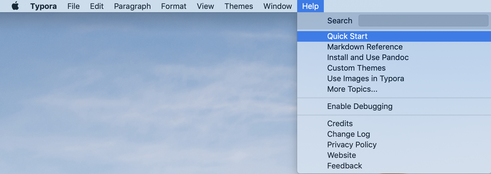
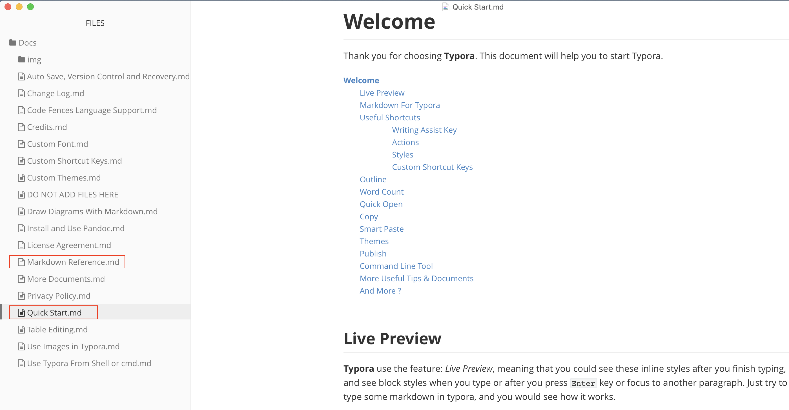
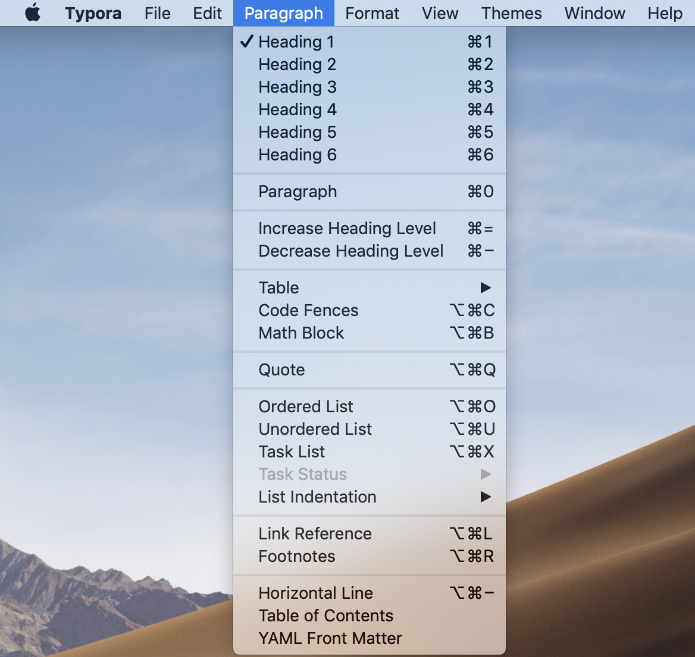
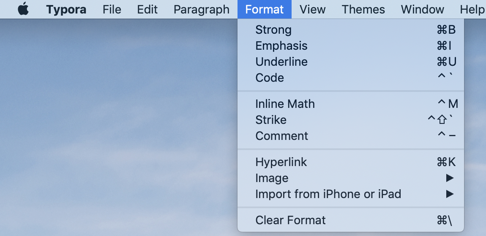
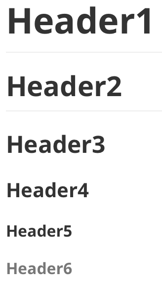
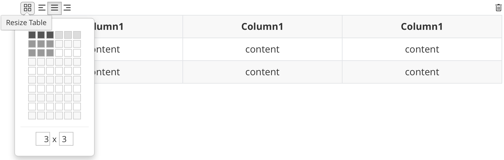

**Markdown编辑利器**


[TOC]


> **Typora**
>
> **工欲善其事，必先利其器。**
>
> **Note:**
>
> - 本文只是着重介绍Typora编辑器的使用，对于什么是Markdown可以自行百度啊，网上资料一大堆。😎
> - 本文示例适用平台: Mac OS (不过其他操作系统也大同小异)。


# 引言

作为软件开发，基本上都会使用一些Markdown文件作为自己项目代码的文档，并且与代码一同托管在同一个代码仓库中，以便于其他人可以通过这些文档快速上手项目代码。

使用Mardown文件作为软件项目文档的原因无非有2个：

1. 语法简单，便于上手，并且代码块语法的设计很适合展示代码。
2. GitHub(以及其他一些Git网站)的默认文档格式，当创建一个Git仓库的时候，一般都会默认询问你是否要创建一个README.md文件，作为该仓库的说明文档。

除了软件开发，另外，比如：

有很多人用GitBook来写书，用的也就是Markdown语法。

微信公众号编辑，也可以选择使用Mardown语法，可以快速写一些简单的样式，而我就是正在用Markdown语法来写这篇文章，哈哈。😄


# 工具

其实，由于Markdown语法真的是很简单，易用，基本上有以下几种使用方法：

## 不借助工具编写

我们可以随便创建一个扩展名为.md的文件，使用普通的TXT编辑器打开，进行编辑就可以了。

不过这种方式的缺点就是没有办法立马预览到最终的展示效果。

## VS Code

安装名为markdownxxx类型的扩展程序，打开.md文件，我们就可以在写的过程中实时预览。

不过这种方式的缺点是可用的快捷方式不多，还是需要书写一些原始的语法。

## Typora

**Typora**就是我们这篇文章说的**利器**。

称其为利器的原因如下：

- 基本上所有的语法都有对应的快捷键，并且支持自定义快捷键。
- 所见即所得，编辑框即是预览框。
- 大量的扩展功能，比如对标准Markdown语法的扩展，甚至支持 `html` `css` `js`。

总之，Typora可以让你专注于书写内容，你几乎不用太关心具体的Mardown语法。


# Typora 使用指南

## 快速上手

话不多说，直接上图 (前提：*官网下载安装Typora*)





直接快速浏览`Quick Start.md`和`Markdown Reference.md`之后就可以将Typora用起来了，不用刻意记住所有的操作细节，因为随时可以在可视化的工具栏中查找你所需要的功能，如下图：





## 常用的操作(快捷键)

### 加粗，斜体，代码，下划线 等等

- `cmd + b`加粗
- `cmd + i`斜体
- `alt + 键盘左上角的那个撇`代码
- `cmd + u`下划线
- ...

### Headers

`cmd + 1~6` 表示 Header 1~6。

效果如下：



### Blockquotes 

`alt + cmd + q`

效果如下：

> This is a blockquote.

### Lists

- 有序列表 `alt + cmd + o`
- 无序列表 `alt + cmd + u`

效果如下：

1. I am ordered list level 1
   1. I am ordered list level 2
      1. I am ordered list level 3
         1. I am ordered list level 4
            1. ...
2. I am ordered list level 1

- I am unordered list level 2
  - I am unordered list level 3
    - I am unordered list level 4
      - ...
- I am unordered list level 1

### Task List

`alt + cmd + x` `ctrl + x`

效果如下：

- [ ] incomplete
- [x] complete

### Fenced Code Blocks

`alt + cmd + c`

效果如下：

```Swift
 enum Language {
   case swift
   case objective-c
   case html
   case css
   case jsp
   ...
 }

 struct Test {
   func test() {
     print("It almost supports all the programming languages in the world.")
   }
 }
```

### Tables

`alt + cmd + t`

效果如下：



### Links

`cmd + k`

1. 内部链接（页面内部跳转）

   > Note: 
   >
   > 只支持跳转到指定的标题，如果想跳转到任意指定位置，可以使用html的知识去实现，这个Typora是支持的，**不过这个就超出了标准Markdown的范畴，使用的时候需要权衡一下。**

   示例如下：

   （*点击下方链接会直接跳转到本文章的 `引言` 标题，不过微信公众号文章不支持非微信官方的链接。*）

   [This is an internal link which will navigate to '引言' part](#引言)

2. 引用链接

   示例如下：

   [This is a reference link which will naviagte to '百度'](https://www.baidu.com)

### URLs

可以使用 `<xxx>` 去标明一个链接，示例如下：

<https://www.baidu.com>

### Images

托拉拽一张图片进来就可以了。

> Note: 
>
> 可以按需修改图片的绝对路径为相对路径，并确保图片路径正确。