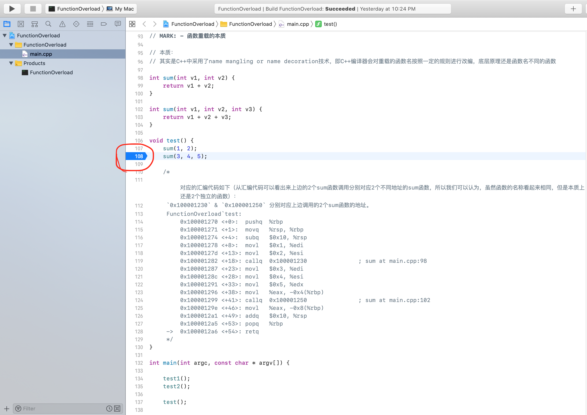
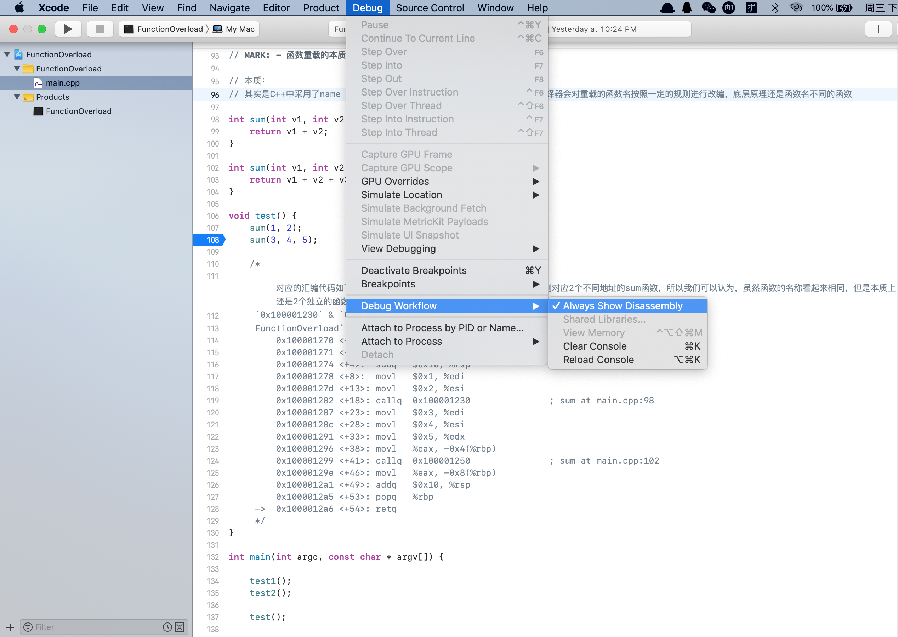
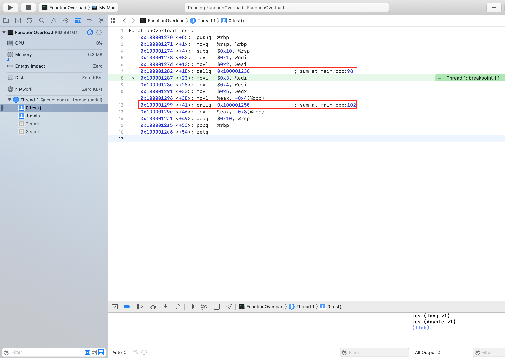

**利用汇编窥探编程语言的本质**


[TOC]


> 本文示例代码，点[这里](../Demo/C++/FunctionOverload)。


# 为什么是汇编？

任何编程语言编写的代码要运行起来，都需要先编译成机器能够识别的二进制可执行文件，比如运行在Mac OS上的Mach-O文件，运行在Windows上的PE格式的exe文件 等等，二进制可执行文件其实就是一串由0和1组成的机器可以识别的代码。也就是说，当程序运行的时候，我们在代码中定义的类，函数，变量等都会以0、1代码被加载到内存中。

大学中学习C语言的时候，谭浩强老师的《C语言程序设计》就有对编程语言进行过分类，0、1机器代码被定义为低级语言，其余的编程语言都可以被归类为高级语言，比如，汇编语言，C语言，C++语言 等等。这里所说的高级编程语言其实就是使用自然语言进行编写的，可读性高的符号语言。

机器码看不懂没有关系，由于汇编代码和机器代码是一一对应的，即每一句汇编代码都有对应的机器码，我们几乎可以把它看成是最终的机器码，所以我们就可以通过分析编程语言最终转换成的汇编代码来窥探编程语言的本质。

比如在C++中有函数重载的概念，示例如下：

```c++
int sum(int v1, int v2) {
    return v1 + v2;
}

int sum(int v1, int v2, int v3) {
    return v1 + v2 + v3;
}

void test() {
    sum(1, 2);
    sum(3, 4, 5);
}
```

看起来函数名相同的两个函数`sum`，因为函数名相同，参数个数不一样，类型不一样，或者顺序不一样就有可能构成函数重载，这样就可以根据传入的参数不同，调用到对应的`sum`函数。

那么C++编译器是怎么办到这一点的呢？其实原理很简单，本质上就是两个内存地址不同的函数。


# Xcode中调试汇编代码

我们可以通过在Xcode中调试汇编代码来证明函数重载的本质。

1. 在代码中适当的位置打一个断点

   

2. 将Debug模式设置成汇编模式

   

3. `cmd + r`运行程序并调试汇编代码

   

   调试汇编代码可以使用`lldb`指令，即在右下角的控制台中输入对应的指令即可，比如，要单步调试可以输入`si`，要查看某一个寄存器存储的数值，可以输入`register read xxx`，等等，关于lldb指令的使用可以自行百度。

通过调试汇编代码，可以看到，在`test`函数体中，有以下两句汇编代码的函数调用：

`callq 0x100001230`

`callq 0x100001250` 

很明显，上边两句汇编代码分别对应以下两句C++函数调用：

`sum(1, 2); // 在内存中的函数地址是：0x100001230`

`sum(3, 4, 5); // 在内存中的函数地址是：0x100001250`


通过调试汇编代码，我们可以看到所谓的函数重载虽然函数名相同，其实本质上在内存中还是对应两个不同的函数。

所以由此可以得出函数重载的本质：

**函数重载的本质就是函数名不同的函数。**


# 结论

对于编程语言的底层原理，我们完全可以剥去语法糖(syntax sugar)，通过调试汇编代码一探究竟。

